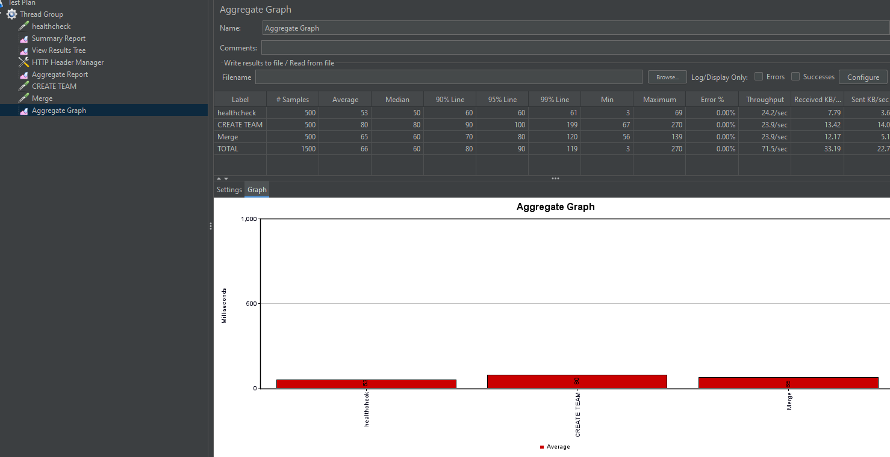

# Запуск описан в makefile

build        - Build Docker images
up           - Start services
down         - Stop services
logs         - Show application logs
clean        - Stop and remove everything
test         - Run all tests
test-unit    - Run unit tests only
test-e2e     - Run E2E tests only
status       - Show service status
health       - Check service health

# Вопросы, с которыми я столкнулся
## TeamMember 
Не сказано может ли быть участник привязан к нескольким командам
Допущение: Судя по запросам юзер может быть только в одной команде

## UpdateUser in a team
Непонятно кто такой администратор, наверное за этим контроль ведется снаружи, так как мы это проверить никак не сможем

## Error for team
Ошибка 400 возвращается, только тогда подаем пустую существующую команду без участников
Иначе создаем команду если нет, обновляем пользователей (добавляем новых, обновляемых старых)

## PR.needMoreReviewers
То ли я читаю невнимательно, то ли ошибка какая-то 
в openapi спецификации нет этого флага поэтому исключим

## Два айдишника одинаковых в разных команднах
Принял решение, что пускай это будет разрешено, так как мы не знаем что происходит снаружи

# Нагрузочное Тестирование с заданным RPS (5 запросов секунду) 
Для нагрузочного тестирования решил использовать Jmeter, так как ранее пользовался им а времени не очень много сейчас, чтобы пробовать что-то новое
Параметры тестирования 
16 gb ОЗУ (1GB Использовано)
intel core i5-8500 2%/600% usage

RPS 5
число итераций 100

результаты

## Ошибки которые я совершил, а мог не совершать

Почему-то думал о каком-то админском токене, не знаю откуда эта информация взялась в моей голове

Еще почему-то решил, что пользователя может деактивировать только админ

## Дополнительно
Сделано интеграционное тестирование и unit тестирование.
Тестируем полный workflow получается, от отправки запроса до записи в бдшку
Интеграционное потому что тестируем view и services а бд у нас вместо postgres sqlite в тестировании.
Если заменить бдшку на postgres будет e2e

Добавлен эндпоинт со статистикой
/

